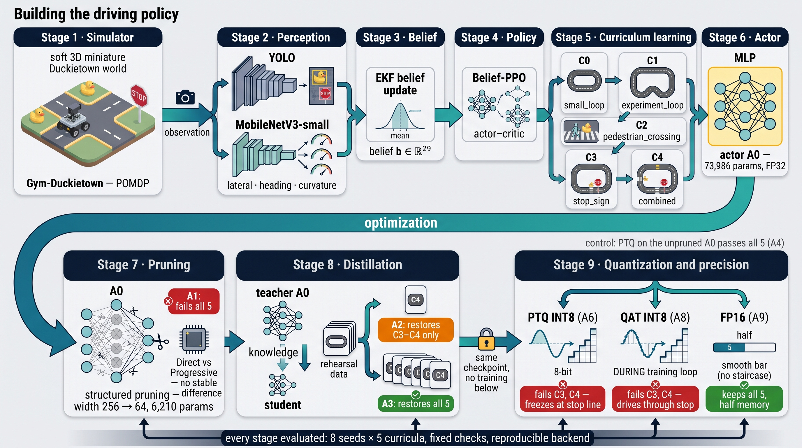
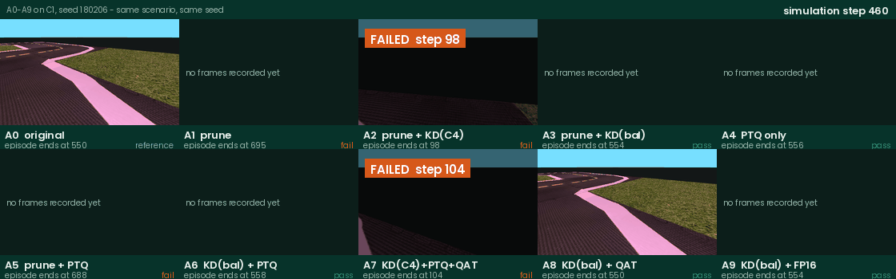

# CompressedAutoDriving

**A Closed-Loop Evaluation of Capability Loss and Recovery in Compressed Driving Policies**

[](https://github.com/ai-vnv/CompressedAutoDriving/actions/workflows/tests.yml)
[](https://codecov.io/gh/ai-vnv/CompressedAutoDriving)
[](#verification)
[](https://github.com/ai-vnv/CompressedAutoDriving/blob/main/.vnvspec/spec.yaml)
[](LICENSE)

Where does a compressed driving policy stop being able to drive, and what brings
that ability back?

This repository is the code and model artifact for the study of the same name,
prepared for the *IEEE Open Journal of Intelligent Transportation Systems*. A
visuomotor driving policy is trained in Gym-Duckietown as a partially observable
Markov decision process, its actor network is extracted, and that actor is then
pushed through a compression pipeline one stage at a time: structured pruning,
knowledge distillation under two different rehearsal coverages, integer
quantization by two routes, and a reduced floating-point control. Every
intermediate configuration has to drive again, on the same eight seeds per
curriculum, against acceptance criteria fixed before any result existed, on an
evaluation backend verified to reproduce bit for bit.

The framing is a scenario-based assessment turned around. Instead of holding the
vehicle fixed and varying the scenarios, we hold the scenario set and the seeds
fixed and let the system under test change at every compression stage.



## All ten configurations, same scenario, same seed



Every panel is media recorded during the evaluation episode itself, placed on a
common simulation-step axis: when a configuration's episode ends, its panel
freezes with the outcome and the step it ended on, while the others keep
driving. This is C1, seed 180206, the one combination captured for all ten
configurations, and C1 applies domain randomization, which is why the lane
markings are not white.

Read it as the pipeline in motion. `A2` and `A7`, both distilled on the hardest
curriculum only, are already dead by step 98 and 104. `A1` and `A5`, pruned
without a usable recovery, wander much longer and fail late, at step 695 and
688. The recovered and reduced-precision configurations that keep the
capability, `A3`, `A4`, `A6`, `A8`, `A9`, complete the route within a few steps
of the original actor `A0`. The recorder keeps only the final 91 steps of an
episode, so a panel reads "no frames recorded yet" until its own window opens.

Regenerate it with
`python experiments/paper_figures/gen_rollout_grid_gif.py`.

## Key results

Verdicts are decided by the same preregistered acceptance checks on the same
eight seeds per curriculum. `ref` marks the unmodified actor the checks are
anchored to.

| Member | Construction | C0 | C1 | C2 | C3 | C4 |
|---|---|---|---|---|---|---|
| A0 | original actor (reference) | ref | ref | ref | ref | ref |
| A1 | prune (width 256 to 64) | ✗ | ✗ | ✗ | ✗ | ✗ |
| A2 | prune, then KD on C4 data only | ✗ | ✗ | ✗ | ✓ | ✓ |
| A3 | prune, then KD on balanced C0–C4 data | ✓ | ✓ | ✓ | ✓ | ✓ |
| A4 | PTQ INT8 of the unpruned actor (control) | ✓ | ✓ | ✓ | ✓ | ✓ |
| A5 | prune, then PTQ, no KD (control) | ✗ | ✗ | ✗ | ✗ | ✗ |
| A6 | A3, then post-training INT8 | ✓ | ✓ | ✓ | ✗ | ✗ |
| A7 | prune, KD(C4), PTQ, QAT(C4) (control) | ✗ | ✗ | ✗ | ✓ | ✓ |
| A8 | A3 parent, then QAT INT8 | ✓ | ✓ | ✓ | ✗ | ✗ |
| A9 | A3, then FP16 cast (precision control) | ✓ | ✓ | ✓ | ✓ | ✓ |

**The study in five findings:**

1. **Pruning is where driving capability is first lost.** Cutting the hidden
   width from 256 to 64 (73,986 to 6,210 parameters, a 91.6% reduction) fails
   all five curricula at once: invalid poses and lane failures on the early
   tasks, and a stop violation in every episode of the stop task.
2. **How much distillation recovers is decided by its rehearsal data.** Same
   teacher, loss, optimizer, and budget: rehearsing only on the hardest
   curriculum restores C3 and C4 alone, while balanced rehearsal across all
   five curricula (62,176 states) restores the complete tested behavior of the
   FP32 actor.
3. **Integer quantization of the improved actor loses the stop curricula, in
   two opposite ways.** From one byte-identical recovered checkpoint, the
   post-training route yields a policy that stops correctly and then never
   moves again, parked 0.22 m before the line until the horizon, while the
   quantization-aware route yields one that drives through the stop at low
   speed.
4. **The same procedure on the unpruned actor preserves all five curricula**,
   and an FP16 cast of the recovered actor keeps all five while halving
   parameter memory. Reduced precision by itself is not what breaks the policy.
   Under the tested procedures the failure needs both the narrow recovered
   actor and integer quantization.
5. **Action-level similarity does not predict driving, in either direction.**
   The quantization-aware model reproduces the original actions more closely
   than the post-training one and drives worse, while the unpruned INT8 control
   drives every curriculum and fails the numerical similarity thresholds.

Negative and qualifying results belong next to the headline ones: no stable
advantage was found between direct and progressive pruning, the distillation
recovery is sensitive to the training seed, and a reserved evaluation split was
never opened because no candidate met the full deployment criterion.

## How the policy sees: perception, EKF belief, 29 inputs

The policy never receives simulator state. Each camera frame feeds two networks
in parallel: a fine-tuned **YOLO11n** detector (pedestrians, stop signs) whose
box bottom-centers are ground-projected into range and bearing measurements,
and a **MobileNetV3-Small** regressor producing lane offset, heading error, and
curvature. **Extended Kalman filters** fuse these over time: a lane filter with
ego-motion prediction, per-object filters paired with Bernoulli existence
filters (a missed detection only erodes existence when the camera could
actually have seen the object), and a stop-obligation state machine. The
posteriors are read out into a fixed 29-dimensional belief vector holding
existence probabilities, means, dispersions, stop mode, ego-motion, and the
previous action.

Only the actor that maps this belief to a driving command is compressed. The
perception stack stays fixed, so behavioral changes are attributable to the
compression stage.

## The five driving curricula

| ID | Map | Challenge | Horizon (steps) |
|---|---|---|---|
| C0 | small loop | lane following, domain randomization | 1,900 |
| C1 | larger loop | longer route, domain randomization | 2,700 |
| C2 | larger loop | crossing pedestrian | 2,700 |
| C3 | larger loop | stop sign: stop, hold, resume | 2,700 |
| C4 | larger loop | pedestrian and stop sign combined | 4,200 |

The two stop curricula are where the quantized configurations fail. They are the
ones that require the policy to interrupt its own driving and then re-establish
it.

## Evaluation protocol

- **Matched closed loop**: 10 configurations, 5 curricula, 8 seeds, so 400
  episodes, with identical seeds for every configuration.
- **Acceptance criteria fixed in advance**: completion, progress, collisions,
  stop compliance and restart, lane keeping, pedestrian clearance, as absolute
  bounds plus regression limits relative to the original actor. No threshold was
  changed after results were opened.
- **Bit-for-bit reproducible**: the deterministic backend was verified, not
  assumed. Three repeats of a full episode produce identical action sequences,
  and the INT8 and FP16 execution paths each passed the same check before use.
- **Two independent axes**: task-level driving verdicts and action-level
  fidelity (error and correlation against the original on identical inputs) are
  measured separately, which is what makes the dissociation in finding 5
  visible.
- **Evidence capture**: camera frames are recorded during the evaluation
  rollouts themselves, never re-rendered, and per-step telemetry is stored for
  every episode.

## Actor cost (single-thread CPU, batch 1)

| | File | Parameter memory | Median latency |
|---|---|---|---|
| A3 FP32 | 29.3 KB | 24.8 KB | 19.4 µs |
| A9 FP16 | 15.9 KB | 12.4 KB | 24.5 µs (+26%) |
| A6 INT8 | 34.1 KB | 7.6 KB | 12.9 µs (1.50×) |

Parameter memory counts weights and biases, at 4 bytes each for FP32 and 2 for
FP16. For INT8 it is unpacked from the deployed graph and counts 1-byte
quantized weights, FP32 biases, and the per-channel scale and zero point
(`experiments/paper_figures/compute_int8_memory.py`). FP16 halves memory but is
slower on this x86 backend, which has no native half-precision execution path,
so it is a memory option and not a speedup. The serialized INT8 file is larger
than the FP32 one because the traced quantized graph metadata dominates. The
actor itself is under 0.1% of end-to-end step cost, since perception dominates.

## Repository structure

```
models/         trained weights: actors A0-A9, YOLO11n, MobileNetV3 lane model
                (each SHA256-verified against the study registries; MANIFEST.md)
configs/        experiment configurations: curricula, acceptance criteria,
                seeds, quantization settings, hash-pinned protocol provenance
experiments/    evaluation runners, protocol-freeze scripts, the
                figure-generation code, and verification/ which recomputes
                every reported number from the ledgers
.vnvspec/       the requirements this study claims, each mapped to the checks
                that verify it
src/            perception (YOLO, MobileNetV3), EKF belief, PPO environment,
                compression (pruning / distillation / PTQ / QAT)
tests/          375 tests that run on a bare clone, of which 344 need no
                simulator, plus a provenance suite that needs the regenerated
                artifacts (721 in total)
maps/, scripts/ simulator maps and utilities
```

Evaluation artifacts, roughly 4 GB of per-episode telemetry, rollout videos, and
result ledgers, are intentionally not tracked. They regenerate from `configs/`
and `experiments/` with the recorded seeds, using the tracked weights in
`models/`.

## Verification

Every number the paper reports is recomputed from the evaluation ledgers rather
than copied from a notebook. The specification lives in
`experiments/verification/verify_reported_numbers.py`: each check restates a
figure as printed in the manuscript and derives it again from the result CSVs,
the frozen configurations, or the protocol loader.

```bash
python experiments/verification/verify_reported_numbers.py
```

The claims themselves are written down rather than left implicit.
`.vnvspec/spec.yaml` states each one as a requirement with its rationale, its
acceptance criteria, and the verifier check groups that establish it. Two
workflows act on it: `vnvspec validate` runs a requirement-quality gate over
the statements, and the V&V workflow reads the committed report
(`experiments/verification/verification_report.json`) and fails if any
requirement's checks are missing or not green, which is also what produces the
V&V badge above. The badge count is verified on every push, not typed in.

The suite comes in three nested groups, and each badge names one of them.

| Group | Size | Needs | Where it runs |
|---|---|---|---|
| core | 344 tests | nothing beyond the repository | GitHub Actions, every push |
| core + simulator | 375 tests | a working Gym-Duckietown install | locally |
| everything | 721 tests | the regenerated evaluation artifacts | locally |

`tests/conftest.py` decides which groups to collect and prints the decision in
the pytest header, so a run always says what it left out.

| Badge | What it measures | Where the number comes from |
|---|---|---|
| tests | the 344 core tests on a clean machine | GitHub Actions, `.github/workflows/tests.yml` |
| codecov | statement coverage of `src/duckie_pomdp` in that run, currently 52% | uploaded from the same workflow |
| full suite 721/721 | every group, with the artifacts present | measured locally |
| V&V spec | requirements in `.vnvspec/spec.yaml` whose checks are green in the committed report | GitHub Actions, `.github/workflows/vnv.yml` |

Three of the four badges are live. Only the full-suite count is a measured
value describing this commit, because it needs the multi-gigabyte evaluation
artifacts that are not distributed here. The V&V badge is live in a weaker
sense worth stating plainly: the workflow re-verifies the requirement mapping
against the committed report on every push, but that report was produced
locally, since the verifier needs those same artifacts.

CI leaves the seven simulator modules out on purpose, with
`SKIP_SIMULATOR_TESTS=1`. They pass against a local Gym-Duckietown install but
depend on the host GL stack and on how the duckietown dependency chain resolves
there; asserting that about a hosted runner would say more about GitHub than
about this code. Coverage is correspondingly lower in CI than locally, where
the full suite reaches 84%.

Coverage reporting needs `CODECOV_TOKEN` in the repository secrets. Until it is
set the workflow still runs and prints coverage in its own log; only the upload
step is inert, and it is configured not to fail the run.

## Reproducing

The stack expects Gym-Duckietown and the pinned environment (`pyproject.toml`,
`constraints.txt`). All evaluation is deterministic:

```bash
export PYTHONPATH=src:experiments
export DUCKIETOWN_HEADLESS=1
export CUBLAS_WORKSPACE_CONFIG=:4096:8

python -m pytest tests -q
python experiments/run_f17_optimization_method_order.py evaluate --pathway A6
```

Two things to know before running:

- **The suite runs on a bare clone.** `pytest tests -q` collects 375 tests and
  all of them pass without any downloaded data: perception, belief, EKF,
  environment, action mapping, and the compression transforms. Set
  `SKIP_SIMULATOR_TESTS=1` to leave out the seven modules that construct the
  real simulator, which is what CI does, and 344 remain. The provenance suite
  that re-derives reported numbers from the evaluation ledgers is collected
  only once `artifacts/` has been regenerated, bringing the total to 721.
  `tests/conftest.py` decides this and prints what it left out.

- **Configuration files record absolute paths from the machine the study ran
  on.** They are deliberately left as they are, because the protocol gates
  verify configuration files by SHA256 and editing a path would break the
  provenance chain the integrity verifiers check. Point them at your own
  checkout and expect the frozen-hash assertions to be the first thing that
  complains.
- **The verification specification needs the artifacts.**
  `experiments/verification/verify_reported_numbers.py` recomputes the reported
  numbers from the ledgers, so it reports what is missing and exits early on a
  checkout that has not regenerated them.

## License

The source code, configurations, and documentation in this repository are
released under the MIT license (`LICENSE`).

Model weights are a separate matter. `models/yolo11n_duckietown_best.pt` is
fine-tuned from Ultralytics YOLO11, which is licensed **AGPL-3.0**, and should
be treated under those terms. `THIRD_PARTY_NOTICES.md` records the provenance
and license of every tracked weight and of the main dependencies. Read it
before redistributing the weights.

## Built on

[Gym-Duckietown](https://github.com/duckietown/gym-duckietown),
[Ultralytics YOLO11](https://github.com/ultralytics/ultralytics),
MobileNetV3 (torchvision),
[Stable-Baselines3](https://github.com/DLR-RM/stable-baselines3),
and PyTorch eager-mode quantization.

Related work from the same line: [DuckieMDP](https://github.com/PannnTastic/DuckieMDP),
certified explanations for the fully observed formulation, and
[Duckietown.jl](https://github.com/ai-vnv/Duckietown.jl), a Julia
reimplementation of the environment validated decision by decision.

## Acknowledgement

This work was supported by the IRC for Smart Mobility and Logistics (IRC-SML),
King Fahd University of Petroleum and Minerals, through research grant INML2654.
